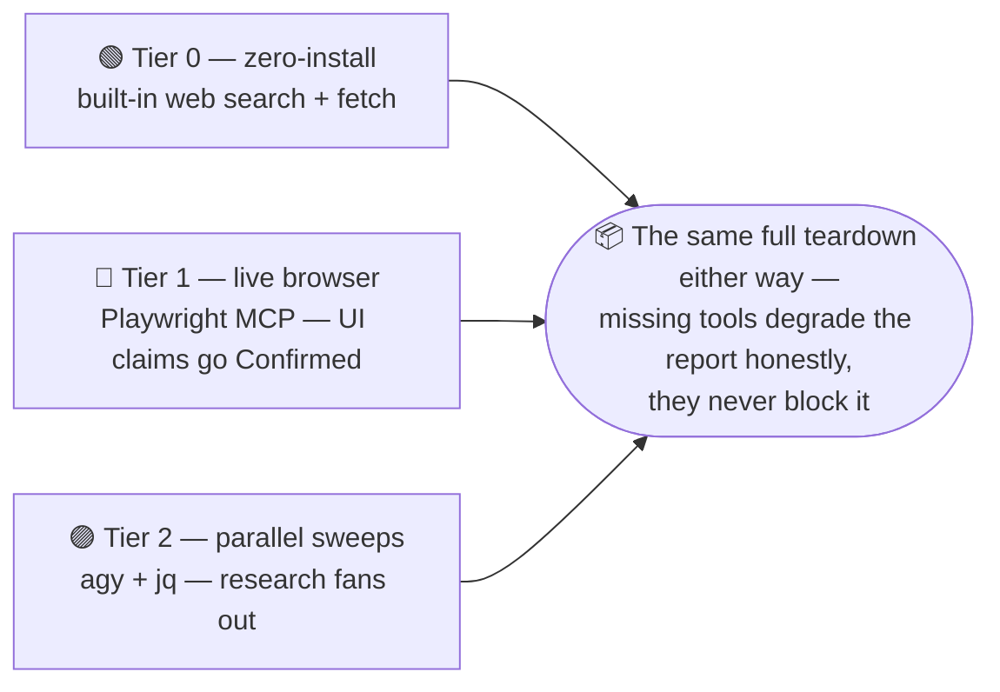
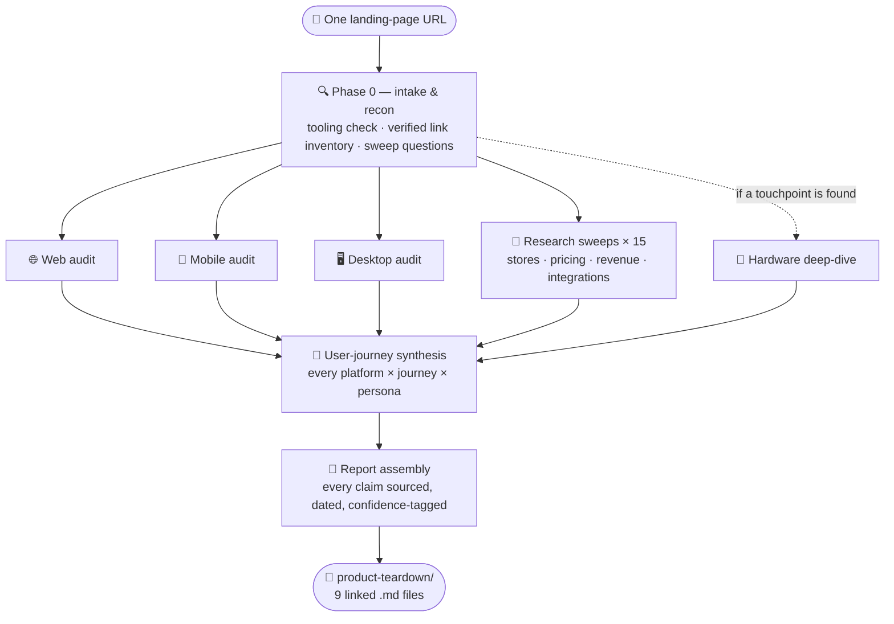
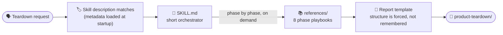

<!-- Centered hero: the logo block intentionally precedes the H1; inline HTML is house style here (MD033 off). -->
<!-- markdownlint-disable MD041 -->
<div align="center">


# SaaS Platform Teardown Kit

**One SaaS URL in, a due-diligence-grade teardown out. A Claude Code skill.**

[](https://github.com/ahmedyehya92/saas-platform-teardown-kit/actions/workflows/ci.yml)
[](LICENSE)
[](https://claude.com/claude-code)
[](CHANGELOG.md)
[](CONTRIBUTING.md)
[](https://github.com/ahmedyehya92/saas-platform-teardown-kit/stargazers)

[What you get](#-what-you-get) · [Quick start](#-quick-start) · [How it works](#-how-it-works) · [Kit anatomy](#-kit-anatomy) · [Examples](#-example-teardowns) · [FAQ](#-faq) · [Roadmap](#-roadmap) · [Contributing](#-contributing)

</div>

Give it a landing page and it produces a structured, multi-file Markdown
teardown of the whole product: what it does, every feature and user journey
on every platform (web / desktop / mobile), how those platforms integrate —
and the business logic behind those choices — plus hardware coverage,
business-scale/revenue signals, and concrete release artifacts per platform.

Every claim is sourced, dated, and confidence-tagged, so the report tells
you not just what the product looks like but how much of that you should
believe.

## ✨ What you get

Nine linked report files per teardown:

```
<product>-teardown/
├── 00-INDEX.md                    # executive summary + access-methods summary
├── 01-overview-and-recon.md       # + complete verified link inventory
├── 02-web-platform.md             # + access log, journeys
├── 03-mobile-platform.md          # + store artifact tables, access log, journeys
├── 04-desktop-platform.md         # + per-OS/arch artifact table, version history
├── 05-user-journeys.md            # all platforms × 5 journeys, personas, handoff map
├── 06-hardware-integrations.md    # device families — or the explicit none-finding
├── 07-integration-architecture.md # + business-objective map
└── 08-pricing-revenue-sources.md  # + revenue estimates with method per figure
```

**Every claim in the report carries one of three confidence tags** — the
reader always knows how much of it to believe:

| Tag | Means | The reader's move |
|---|---|---|
| 🟢 **`Confirmed`** | Directly observed — screenshot, DOM, API response, official doc | Trust it; check the report date |
| 🟡 **`Reported`** | A secondary source states it — review, forum, press | Re-verify before deciding on it |
| 🟠 **`Inferred`** | Deduced from indirect evidence — reasoning shown, not just the conclusion | Read the reasoning first |

## 🚀 Quick start

### 1 · Pick your tier

Nothing is required to start. Each tier adds capability; every tier
degrades gracefully when missing.



| Tier | You need | It unlocks | Without it |
|---|---|---|---|
| **0 — zero-install** (default) | Claude Code | Full teardown via the built-in web search/fetch tools; static web audit | — this is the floor |
| **1 — live browser** (recommended) | Playwright MCP — `claude mcp add playwright -s user -- npx @playwright/mcp@latest` | Live in-app exploration, authenticated-state screens, UI claims upgraded to `Confirmed` | Web audit limited to static fetches; UI claims stay `Reported` |
| **2 — parallel research** (optional) | [`agy` CLI](https://antigravity.google/cli/install.sh) + `jq` | The 15 research sweeps fanned out as parallel headless jobs | Same sweeps run sequentially on built-in search — slower, same depth |

### 2 · Install

Tier 0 is one step:

```bash
cp -r saas-platform-teardown ~/.claude/skills/saas-platform-teardown
```

Then restart Claude Code (skills and MCP servers load at session start).
For Tier 1/2 setup — Playwright MCP registration, `agy` permissions, and
the verification snippets — see [setup.md](setup.md).

### 3 · Run it

```
> Do a full platform teardown of https://linear.app
```

or name the skill explicitly:

```
> Use the saas-platform-teardown skill on https://linear.app
```

Claude Code matches the request to `SKILL.md`'s description, works phase
by phase through the reference playbooks, and writes the report folder
under `./<product-slug>-teardown/` in your working directory.

## 🔬 How it works

One URL enters; the kit runs recon first, fans the five research tracks
out in parallel, then closes by synthesizing journeys and assembling the
report (the dashed track is conditional):



The design principles:

- **One skill, one job, progressive disclosure.** The orchestrator is
  short. Depth lives in `references/`, loaded on demand — the documented
  Claude Code pattern, not an improvised one.
- **Tools do what they're good at.** Live DOM/UI truth comes from the
  configured browser (Playwright MCP when present), not from guessing what
  a page looks like. Broad, fast-moving facts (app store data, pricing,
  revenue estimators, integration directories) are swept by a dedicated
  research pass — fanned out in parallel through `agy` when installed, run
  sequentially on the built-in search otherwise. Claude Code does the
  synthesis, verification, and writing — the part that needs judgment.
- **Decision-grade, not feature-list-grade.** A teardown answers "is this
  product a real threat?": full user journeys per platform, business
  objectives behind every integration, explicit hardware answers,
  revenue/scale signals with methods, and release artifacts per platform —
  not just "an app exists."
- **No credentials is a methodology, not a dead end.** Self-serve trials
  are used when offered; genuinely gated products get the documented
  no-credential ladder (demo videos, help-center screenshots, reviews,
  Wayback, API docs) — and every platform section logs which methods
  produced its claims, so the reader can weigh verified truth against
  secondhand reconstruction.
- **Every claim is sourced or flagged.** The report template forces a
  Confirmed/Reported/Inferred distinction and a source link per section,
  because SaaS products change weekly and an undated, unsourced teardown
  is worthless in three months.

## 📦 Kit anatomy

This is not a single prompt. It's a **skill package** — a short orchestrator
(`SKILL.md`) plus phase-specific reference playbooks, designed around how
Claude Code's Skills system actually works: metadata loads at startup, the
orchestrator loads when the task matches, and each playbook loads only when
the orchestrator points at it. That progressive disclosure is what makes it
reliable instead of a wall of instructions held in one context window.



```
saas-platform-teardown/
├── SKILL.md                       # short orchestrator — loads when the task matches
├── references/                    # depth lives here, loaded on demand
│   ├── 01-intake-and-recon.md
│   ├── 02-web-platform-audit.md
│   ├── 03-mobile-platform-audit.md
│   ├── 04-desktop-platform-audit.md
│   ├── 05-integration-architecture.md
│   ├── 06-research-sweeps.md
│   ├── 07-report-assembly.md
│   └── 08-hardware-integrations.md
└── assets/report-template/        # the structure every report must follow
```

## 🧪 Example teardowns

| Product | Platforms covered | Engines / tier | Researched |
|---|---|---|---|
| [Linear](examples/linear-teardown/00-INDEX.md) | web · iOS · Android · macOS · Windows | Engine A (built-in search) · Tier 1 | 2026-09-07 |
| [Oura](examples/oura-teardown/00-INDEX.md) | hardware · iOS · Android · web dashboard | Engine A (built-in search) · Tier 0 | 2026-09-07 |

Full teardowns generated by running this kit, committed as point-in-time
research snapshots: SaaS products ship weekly — treat the specifics as
dated; the methodology is the durable artifact. Provenance and run notes
in [examples/README.md](examples/README.md).

## ❓ FAQ

<details open>
<summary><b>Is this legal / ethical to run?</b></summary>

The operating rules hard-code the answer. It uses only sanctioned access:
self-serve free trials or freemium tiers with a disposable identity, public
pages, public store listings, and public docs. It never provides real
payment info, never scrapes behind a paywall, never bypasses auth or bot
protection, and stops at any payment-or-ID-verification wall. Mobile stops
at store-listing metadata — no APK/IPA extraction. When a surface is
enterprise-gated, it switches to the documented no-credential ladder
instead. It does research a competent analyst could do by hand; it just
does it in one sitting.

</details>

<details>
<summary><b>Does it need <code>agy</code>, Playwright, or any MCP server?</b></summary>

No. Tier 0 — just the skill directory — is the default path and produces
the full report. Tier 1 (Playwright MCP) upgrades UI claims from
`Reported` to `Confirmed` by exploring the live app. Tier 2 (`agy`) makes
research faster by fanning it out. Missing tools degrade the report
honestly instead of blocking it.

</details>

<details>
<summary><b>What does a run cost?</b></summary>

It's a long agentic research run — expect deep-research-session scale, not
a chat message: the skill reads dozens of pages, fetches store listings,
and walks user journeys. Tier 2 shifts the sweep traffic to `agy`
(Gemini-backed) and away from your Claude usage. You'll see the token
meter move; that's what due-diligence-grade coverage costs.

</details>

<details>
<summary><b>Why confidence tags instead of just facts?</b></summary>

Because SaaS products ship weekly and models' training data goes stale.
`Confirmed` (directly observed) / `Reported` (a source says so) /
`Inferred` (reasoning shown) tells the reader exactly what to re-verify
before making a decision on this report — and the header date bounds how
much of it has already decayed.

</details>

<details>
<summary><b>Does it work outside Claude Code?</b></summary>

v1.0 is Claude Code-only. The kit deliberately concentrates
harness-specific tool names in two places (the Before-starting block and
the browser/engine sections) so a multi-harness adapter is a mapping
exercise, not a rewrite — see the roadmap.

</details>

## 📍 Roadmap

- **Multi-harness adapters** — same playbooks, other agent harnesses.
- **More examples** — examples are generated by running the finished kit
  and regenerate on minor-version milestones (next: hardware-centric).
- **Community sweeps** — new research sweeps follow the house shape
  (role / one question / sourcing / output shape); see
  [CONTRIBUTING.md](CONTRIBUTING.md).

## 🤝 Contributing

Playbook conventions, the validation gate, and the example policy are in
[CONTRIBUTING.md](CONTRIBUTING.md). `scripts/validate-skill.sh` checks the
kit's structural invariants; CI runs it plus markdownlint and a link check
on every push. MIT licensed — see [LICENSE](LICENSE).

---

<div align="center">

<b>SaaS Platform Teardown Kit</b> · [v1.0.0](CHANGELOG.md) · MIT · built for [Claude Code](https://claude.com/claude-code)<br/>
<sub>One skill, one job, decision-grade output.</sub>

</div>
